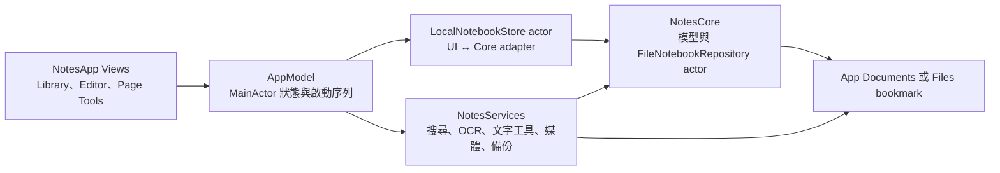

# NextStep 架構與資料安全

NextStep 採 local-first、iPad-first 架構：筆記編輯不依賴 NextStep 自有帳號或伺服器，資料寫入使用者可控制的 Files 位置。最低系統為 iPadOS 18，主要使用 Swift 6、SwiftUI、UIKit、PencilKit、PDFKit、Vision、AVFoundation 與 Speech。

目前 UI 透過 `LocalNotebookStore` adapter 使用 `NotesCore.FileNotebookRepository`，筆記內容沒有第二套平行 schema。trash、kind、cover hue 等純 UI 狀態保存在 library sidecar；notebook title、favorite、pages、ink、elements、handwriting recognition／reviews、assets 與 audio descriptors 由 Core package 擁有。

## Target 與相依關係



| Target | 責任 | 目前接線狀態 |
| --- | --- | --- |
| `NotesApp` | App lifecycle、三欄筆記庫、編輯器、PencilKit bridge、PDF／圖片背景、Files picker、Core adapter、內容搜尋、手寫 review 與 Page Tools | 主要筆記流程與手寫 review 已接 UI；仍需 Xcode／實機與無障礙驗證 |
| `NotesCore` | 穩定 ID、manifest／page／element／asset／audio／handwriting review 模型、`NotebookRepository`、transaction、operation log、snapshot、驗證及復原 | 已用於日常 App 儲存；診斷／復原 UI 未接 |
| `NotesServices` | 搜尋索引、Vision OCR、PDF 文字／掃描頁 fallback、錄音與時間標記、裝置端語音、備份、學習排程、模型管理、非生成式文字工具 | 搜尋與 OCR primitives 已接 App；雲端或生成式 runtime 不在目前範圍 |

Scheme 目前定義四個測試 target：

| Test target | 目前程式碼涵蓋 |
| --- | --- |
| `NotesCoreTests` | package round-trip、transaction recovery、snapshot、資產完整性、page CRUD、手寫 sidecar CAS／stale／future schema／recovery、損毀復原與 migration |
| `NotesServicesTests` | 搜尋 snapshot／revision、安全邊界、OCR／媒體輸入驗證、備份、數學、學習排程與 extractive tools |
| `NotesAppTests` | 慢 bootstrap 與 create/import race、刪頁清除搜尋文件、document search debounce／聚合／晚回 fencing、duplicate rollback，以及手寫 raster／review／搜尋／取消／library-root 競態 |
| `NotesAppUITests` | Quick Note 開啟畫布、Library destinations，以及慢 bootstrap 下立即建立 Quick Note 不被舊 snapshot 覆蓋 |

這四個 target 已寫入 `project.yml` 與 scheme，但仍須實際 Xcode 26 run 才能視為通過；文件不把「target 存在」等同 CI 綠燈。

## App 啟動與資料流

`AppModel` 是 `@MainActor` 狀態入口，畫面只透過 `NotesAppNotebookStore` protocol 操作資料。Concrete implementation 是 actor-isolated `LocalNotebookStore`；它負責 UI/Core model mapping、Files bookmark 與 UI sidecar，durable notebook content 委派給 `FileNotebookRepository`。

```text
LibraryView / NotebookEditorView / NotebookToolsSheet / SettingsView
                              │
                           AppModel
                    ┌─────────┴─────────┐
          NotesAppNotebookStore    NotesServices actors
                    │
           LocalNotebookStore actor
                    │
       FileNotebookRepository actor
                    │
       App Documents 或 Files bookmark
```

啟動時，所有初始 reader／writer 共用一個 bootstrap task。task 讀取 library 與 root description，保留仍有效的搜尋 documents，重建 notebook title、page navigation、canvas 與 accepted handwriting documents，完成 reconciliation 後才允許 create／import 等 mutation。這避免慢速初始 snapshot 在新筆記建立後才回來並覆蓋 UI 狀態。

切換 library root 採 close-before-switch：任何 Editor lease（含離開畫面後尚在做最後 flush 的 lease）存在時都拒絕切換；每個 lease 也綁定 root generation，頁面結構 mutation 必須出示同一 lease，因此已關閉 Editor 的晚回 UIKit／PencilKit callback 或排程不能寫進新 root。App 先封鎖新 operation，以共用 deadline drain page writes、Editor reads、OCR、export session、辨識與 review。若冷啟動的舊 bookmark／provider 已失效或卡住，使用者仍可取消該 bootstrap 並選擇替代位置；bookmark resolution、repository 建立與 metadata read 都在 store actor 外執行。每次 library scan 持有 root-keyed inspection lease，finalize／rollback 會延後釋放仍被晚回 scan 使用的 security scope，同 root 的晚到 acquisition 也會轉交目前 route。候選位置準備成功後，store 才以常數時間安裝保留舊 repository／bookmark／scope 的可回滾 candidate transaction。Candidate bootstrap 只驗證並載入 library，不接觸全域搜尋索引；bookmark 必須同步落盤，tentative commit 經過 MainActor 最後一道 reentrancy fence 後才 finalize。逾時或失敗會立即還原 routing／bookmark，晚回 preparation 或 scan 再由 token／inspection lease 清理。

搜尋索引是跨 root 共用的 derived cache，因此 root bookmark commit 前會先持久化 `rootRebuildRequired` authority marker。成功後查詢保持 fail closed，背景 repair 強制把 primary 與 backup 都重寫為空，再重建目前 root；只有清除與 marker 同步都成功才重新開放搜尋。若 App 在任一 commit 邊界被終止，冷啟動會看見 marker、先重做完整清除；若清除失敗，Library 仍可開啟，但搜尋持續關閉並在後續查詢重試。每個查詢也在 await 後重新驗證 library epoch／root generation，防止切換前已開始的晚回結果被發布。

預設 root 是 App Documents 中的 `Notes` 目錄。使用者在設定選擇其他 Files／iCloud Drive 資料夾時，App 保存 security-scoped bookmark，並在所選位置建立 `Notes` 子目錄。此舊資料路徑刻意不隨顯示名稱改成 NextStep，以免既有筆記失聯或需要破壞性 migration。

Library root 另有 `.notes-ui-metadata.json`，只保存 `NotebookKind`、trash timestamp 與 cover hue，並以 atomic write 更新。Notebook title、favorite、pages、ink、handwriting recognition／review sidecar 與 imported assets 都在 Core package；匯入 PDF／圖片時先寫入 SHA-256 content-addressed asset，再建立引用該 asset 的 page backgrounds。

## NotesCore `.notepkg`

`FileNotebookRepository` 是 App 使用的本機 repository，並由 actor 序列化操作。公開介面涵蓋 create／open／list／metadata／delete、page 新增／刪除／排序／導覽 metadata、ink、elements 與 handwriting review round-trip、content-addressed asset、operation log、library index、snapshot export、validate 及 recover。

固定 layout：

```text
<NotebookID>.notepkg/
  manifest.json
  manifest.backup.json
  pages/
    <PageID>/
      page.json
      ink.data
      elements.json
      handwriting-recognition.json
  ops/
    local/
      <zero-padded-sequence>-<OperationID>.json
    transactions/
      <OperationID>/
        transaction.json
        transaction.backup.json
        staged/
        backups/
  assets/
    <sha256>
  audio/
  derived/
    previews/
    search/
```

`manifest.json` 是權威狀態，包含 schema version、revision、pages、assets、audio sessions、tags 與 favorite。每頁 `handwriting-recognition.json` 保存不可變 machine candidates 與分離的人工 reviews，並以來源 ink SHA-256、run ID 及 revision CAS 防止 stale 覆寫；它不把機器建議直接視為使用者文字。`ops/local` 是 mutation 稽核與復原輔助資料，不是能從任意時間點完整重播所有內容的 event-sourcing 系統。

### Write-ahead transaction

Core mutation 不再採用「先改 manifest、之後才盡力寫 log」的鬆散順序。每次跨檔 mutation 使用 `ops/transactions` 的 write-ahead journal：

1. 在開始新 mutation 前解析既有 pending transactions，並確認 live manifest revision 符合預期。
2. 在 transaction directory 寫入 `transaction.json` 與其 backup；所有新內容先放進 `staged/`，被覆寫的原檔先複製至 `backups/`。
3. 套用 staged files。`manifest.json` 被刻意排在最後，它的目標 revision 是 durable commit marker；transaction 必須恰好把 revision 增加一。
4. 若 manifest 尚未提交就失敗，使用 backups rollback；若 rollback 也中斷，保留 durable journal 讓下一次操作或 recovery 重試。
5. manifest 已提交後，將 journal phase 更新為 `stateCommitted`、補寫 `ops/local` command，再清除 transaction directory。若 phase、operation log 或 cleanup 失敗，不把已提交的使用者操作回報為失敗，而是保留 journal，之後 deterministically roll forward。

這個設計讓 repository 能區分「狀態尚未提交，應 rollback」與「狀態已提交，只缺 operation record／cleanup」。它不提供多 notebook transaction，也不取代外部備份。

### `exportSnapshot`

分享完整 notebook 時，App 不直接把 live package URL 交給 share sheet。`LocalNotebookStore.packageURL` 呼叫 Core `exportSnapshot`：

1. 在 repository actor 內解析 pending transactions。
2. 拒絕 source／destination 相同或互相巢狀的路徑。
3. 複製 live package 到目的目錄旁的隨機 staging directory。
4. 對 staging package 執行完整 validation。
5. validation 成功後才以 move／replace 提交目的 `.notepkg`。

這提供同一 actor 時點的一致 package snapshot；它不是整個 library 的備份，也沒有自動排程。

### 驗證與復原

`validateNotebook` 會檢查：

- 遺留 temp、pending／損毀 transaction journal。
- 缺少、無法解碼或 ID／revision 不一致的 manifest。
- 重複、缺失或 orphan page directory。
- 無法解碼的 `elements.json`、handwriting sidecar 或 operation record；手寫 bounds、candidate／review 關聯、revision 與來源 ink fingerprint 也會驗證。
- asset 缺檔、byte count 錯誤或 SHA-256 digest 不符。

`recoverNotebook` 先解析 pending transaction，再清理 temp、隔離損毀 operation record 與目前 schema 的損毀 handwriting sidecar；未來 schema sidecar 會原樣保留並拒絕覆寫。必要時採用 manifest backup 或 page descriptors 重建 manifest，處理重複／缺失／orphan pages、無效 asset reference、elements defaults 與 schema migration，最後重新驗證並重建 library index。ink 改變造成的 handwriting staleness 會被報告但不阻擋 snapshot。

Core recovery API 已存在，但 App 尚無使用者可理解的診斷、確認與 restore UI。裝置遺失、使用者刪除或整個 package 消失仍必須依賴外部備份。

`PageDescriptor` schema v4 新增可選的平面 `outlineTitle`，並沿用 v3 的 `isBookmarked`。v1–v3 解碼會安全預設沒有大綱，v3 的 structured-page `content.json` 要求則由獨立版本常數維持，不會因 descriptor 升到 v4 而被放寬；舊版 structured page 首次寫入導覽 metadata 時，也會在同一 transaction 補齊空的 `content.json`，避免升版後成為無法開啟的 v4 page。非空大綱必須是已 trim 的單行文字、不含換行或不安全控制／格式字元（保留 Unicode ZWNJ／ZWJ）、最多 120 個 `Character` 且不超過 1,024 UTF-8 bytes；decoder 與 repository mutation 都 fail closed。

書籤／大綱同時存在 manifest 的 page array 與各頁 `page.json`。`updatePageNavigationMetadata` 每次只修改一個指定欄位，並以 repository 最新 descriptor 合併，避免兩個 Editor 的舊 snapshot 互相覆蓋；寫入前會以 bounded／no-follow read 要求兩份完整 descriptor 相等，遇到 Files provider 的部分同步狀態就不改動任何檔案。顯式 recovery 才會採用合法的 disk `page.json` 作為權威，記錄 reconciliation action 並耐久重寫 manifest。既有 write-ahead journal 會在同一 transaction 更新兩份 descriptor、revision、modified time 與 operation log；operation payload 只記錄欄位與布林狀態，不複製大綱明文，navigation transaction 亦把同 revision 的 manifest 寫入 recovery backup，讓清除／取代的大綱不會永久殘留。無變更時不增加 revision，任一 write 失敗會回復所有檔案；transaction 的受保護 manifest／`page.json` 讀寫有 no-follow 與大小上限。`validateNotebook` 會把兩份完整 descriptor 不一致回報為錯誤。App 只透過這個窄 mutation 更新導覽 metadata，並以 library epoch、Editor root-generation lease 與 mutation ID 防止晚回結果發布；寫入期間會與切頁、搜尋跳頁、頁面結構操作、Replay 及 PDF export 串行化，但不阻擋錄音。

## Import、頁面與分享

`LocalNotebookStore` 目前負責：

- App `UUID`／`EditorNotebook` 與 NotesCore IDs／manifest／page models 的轉換。
- 將 `PKDrawing.dataRepresentation()` 傳給 Core `saveInk`／`loadInk`。
- 透過 Core bounded read 與 transaction API 載入／保存 `handwriting-recognition.json`，並以 run／revision CAS 與目前 ink digest 拒絕 stale review。
- 把 PDF／圖片轉成 content-addressed asset 與 `.pdf`／`.image` page background。
- 匯入 `.notepkg` 前拒絕 symbolic link、讀取 manifest ID、避免重複 ID、copy 至 library、validate，失敗時移除不完整目的檔。
- 新增／刪除／上移／下移與複製頁面；duplicate 的 ink write 失敗時 rollback manifest，rollback 也失敗則 reload repository 已提交狀態。
- 映射頁面書籤／自訂大綱，並由 Navigator 依全部／書籤／大綱保留原頁碼導覽；duplicate 刻意清除這兩個個人導覽欄位。
- 透過 Core `exportSnapshot` 產生分享用 `.notepkg`。

`PencilCanvasView` 是 SwiftUI `UIViewRepresentable`，包裝 `PKCanvasView` 與外層 `UIScrollView`。頁面切換時用 page ID 與 drawing revision 避免舊 drawing 寫入新頁；外部載入 drawing 時抑制 delegate save；drawing 尚未載入前禁止輸入。畫布變更會立即把最新 data stage 到 `AppModel`，由中央 per-page queue 做 debounce 與序列寫入；切頁、刪頁、package export、backup 及 App 進背景都會 drain queue。失敗的最新 payload 留在 pending state，可再次 flush，不以固定 sleep 猜測保存完成。

`PageExportRenderer` 可以把目前頁面的紙張模板、指定 PDF page 或圖片背景，加上 PencilKit drawing，輸出單頁 PDF；另有有界的白底、黑色 ink-only raster 路徑供手寫辨識，刻意排除背景與 canvas elements。它不保留可編輯 PDF annotation objects 或 outline。

## 搜尋、OCR 與本機文字工具

| 服務 | 已接 UI 的行為 | 還沒有的能力 |
| --- | --- | --- |
| `LocalSearchIndex` | JSON snapshot、backup recovery、revision-aware upsert、標題排名、繁中 bigram，以及有 500 筆硬上限的 notebook-scoped segment query；page outline／bookmark、typed pages、canvas text／sticky／link title、OCR、accepted handwriting 與逐字稿各用可獨立協調的 source／document namespace，Library 可跳首個命中頁，Editor 以自適應 sidebar／sheet 顯示依頁序聚合的跨頁結果 | zoom-aware bounds highlight、結構化 block 精準定位、套索轉 editable text |
| `PDFTextExtractor` | Page Tools 擷取指定 PDF page selectable text；empty document 時渲染該頁交給 Vision | 匯入時背景批次 OCR、互動 PDF selection UI |
| `VisionTextRecognitionService` | Page Tools 對圖片或渲染後掃描 PDF 做 accurate OCR；手寫 pipeline 對 ink-only raster 產生有界 suggestions，再由 review UI 修正／接受／拒絕 | 不保證任意字跡可靠、無專用 handwriting model、尚無 bounds highlight／套索轉文字 |
| `ExtractiveIntelligenceProvider`／`LocalIntelligenceRouter` | Page Tools 提供摘要、文字整理、outline、meeting notes、quiz、問答與解釋；可顯示來源片段 | 真正 LLM、RAG、embedding、生成式新內容 |
| `MathExpressionEvaluator` | Page Tools Calculator 執行確定性文字算式 | 手寫數學辨識、逐步解題 |

背景內容 extraction 目前是使用者在 Page Tools 主動觸發，不會因匯入檔案就自動 OCR。Page navigation 以 notebook＋page 派生一個 UUID-v8 文件，內含穩定、分離的 outline／bookmark segment ID；大綱採一般全文比對，boolean 書籤只接受完整的中英文 semantic aliases，不把隱藏 alias 複製成使用者 snippet，也不讓衍生文件重複的 notebook title 製造任意頁面目標。每次欄位 mutation 先隱藏舊文件，再從 durable notebook 重讀完整頁面狀態；per-page generation、revision retry、commit verification 與綁定 title／fingerprint／segment payload 的正向授權，讓反序完成或殘留 orphan 不能發布舊資料。含導覽 segment 的畸形 mixed-source 文件也只能產生導覽命中。

取消若發生在 durable commit 之後，會由獨立且 generation-conditional 的 repair 重新載入權威狀態；整本筆記保存另建立可交棒 recovery token，先在原 operation lease 內發布 durable summary，再於一般取消後或 failed-root rollback 後從 fresh durable notebook 重建 title、raw OCR／typed page、navigation、canvas 與 handwriting 標題，成功切換 root 則丟棄舊 root token 並由全量 rebuild 接管。所有帶 notebook title 的 page-derived full upsert 與原子 retitle 都在 `LocalSearchIndex` actor 內讀取 `id == notebookID` 的 title-authority document；title authority 另有 serial publication generation，因此反序抵達的舊高 revision 也不能覆蓋新名稱。重新命名先完成、舊 OCR 或其他 payload 才晚回時，不會把捕捉的舊標題寫回。authority 缺失會 fail closed，recovery 不會消耗 token；個別非導覽內容重建失敗則顯示錯誤並由後續保存或 bootstrap 重試。完成 recovery 後也會以原 query 刷新 Library 搜尋快取。

清除、刪頁、匯入與 bootstrap reconciliation 同樣會移除或重建文件；啟動時也會以 durable page IDs 清除中斷刪頁留下的 raw typed／PDF／OCR orphan。Canvas text、sticky 與 link title 在元素檔成功保存後寫入另一個 notebook＋page UUID-v8 搜尋文件。Handwriting 使用再一個 namespace，只有人工接受且 ink SHA-256 仍相符的 review 會發布；一有 staged ink、Reject／Reset 或無法驗證 durable source，就先以記憶體 suppression fail closed，索引移除失敗也不會讓舊 snippet 繼續出現在已發布查詢。相同可搜尋 payload 不重寫 snapshot。刪除頁面會以精確 document ID 原子移除 raw page、navigation、canvas 與 handwriting documents，並在持久化前留下 process-lifetime page tombstone，阻止已開始的 OCR／其他 page publication 晚回復活；跨頁 audio transcript 不會被這個 page-owned 清除誤刪。永久刪除 notebook 會移除整本 documents。

## 主要服務接線狀態

| 服務 | 已實作程式碼 | 仍缺少 |
| --- | --- | --- |
| `AudioTimelineRecorder`／Player／Note Replay | M4A/AAC 錄放、麥克風權限、command/page 時間標記、指定時間播放、真實 transport、唯讀 Replay Editor、schema v3 baseline／change／terminal scene history、內容定址 ink／element snapshots、scene-level LRU、descriptor/session-bound 讀取，以及刪頁後的原子 history redaction／無引用 payload GC | 筆尖 sample 級漸進動畫、頁面背景／結構事件；舊錄音維持 final-stroke 相容 |
| `OnDeviceSpeechTranscriber` | Apple Speech on-device recognition、時間 segments、Editor 語言 UI、原子保存、本機與 panel 內搜尋、點擊跳時間、TXT／SRT 匯出 | 更多裝置語言 QA；未內建 Whisper |
| `FileBackupService` | security-scoped destination、snapshot、prune、容量／path traversal 防護、同 ID 全量拒絕的 restore；Settings 已接建立、歷史與還原 | 自動排程，以及 trash／kind／cover sidecar 的完整 library metadata backup |
| `StudyScheduler` | again／hard／good／easy 間隔計算、Study Set 編輯與到期複習 UI | 全卡 Practice、CSV／TSV 匯入、顏色、TTS、提醒與 Time Keeper |
| `ModelDownloadManager` | data artifact 路徑防護、容量檢查、SHA-256、staging install、rollback、列出／移除 | model catalog、實際 ML runtime 與設定 UI |
| Core elements | text、image、shape、connector、sticky、tape、sticker、link models 與畫布 select／transform／edit UI | Smart Ink、connector attachment、無限 Whiteboard 與 rich Text Document schema |

## 無後端邊界

NextStep 沒有自有 API、database、登入系統、推播協作服務或公開分享 host，因此目前不包含：

- 即時多人共同編輯、presence、留言與衝突合併。
- 公開／私人網頁分享連結。
- NextStep 帳號及跨平台 App sync。
- Marketplace、Classroom／企業管理、Email-to-note。

選擇 iCloud Drive folder 時，Apple Files 可能在同一 Apple Account 的裝置間同步檔案；這是 file-level transport，不等同 CloudKit 資料模型或即時協作。多裝置同時編輯同一 package 的 conflict policy 尚未完成。

## 建置與供應鏈

- `project.yml` 是 Xcode project 的單一來源，產生出的 `Notes.xcodeproj` 被忽略。
- workflow 已配置 `macos-26`／Xcode 26、XcodeGen、四個 test targets、generic-device unsigned build 與 IPA artifact。
- CI 明確停用 code signing，不保存 Apple identity；Windows 的個人簽署在 Sideloadly 完成。
- JavaScript actions 固定到 commit SHA，並指定 Node 24 runtime；IPA artifact 保留 7 天。
- 模型下載服務只接受 descriptor 指定的 data artifact，驗證安全相對路徑及可選 SHA-256；沒有下載並執行遠端程式碼的設計。

目前尚未取得實際 macOS／Xcode 26 CI 綠燈，因此以上描述的是設定與程式碼意圖，不是已完成的編譯、模擬器或 iPad 實機驗證結果。
