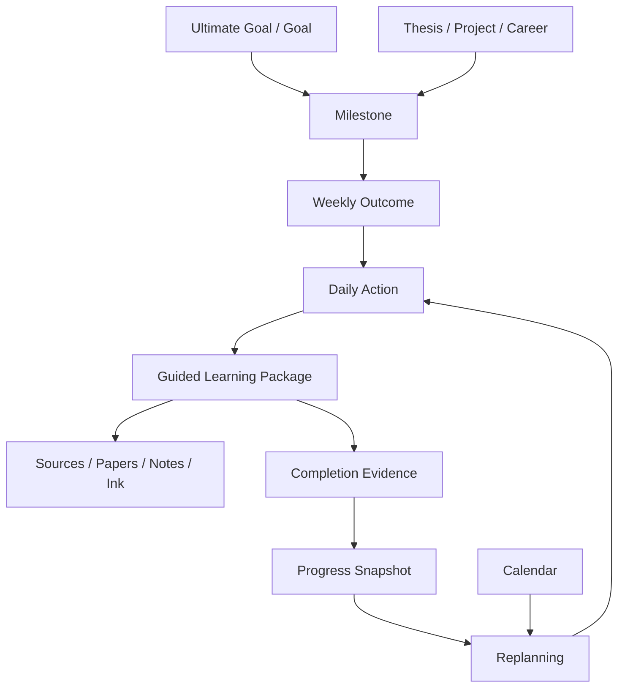

# 03 — Information Architecture

## Canonical destinations

| Destination | Purpose | Key relationships |
| --- | --- | --- |
| Today | Execute prepared actions now | opens Guided Package; writes progress/replan events |
| Goals | Ultimate goals, goals and milestones | owns outcome/action lineage |
| Plan | Week, backlog, capacity and replan diff | consumes goals, calendar and progress |
| Learning | Courses, sessions, concepts, quizzes and review | links packages and sources |
| Workspaces | Thesis, Projects and Career | generates milestones/artifacts/actions |
| Papers | discovery, library, comparison and reader | specialized SourceDocuments |
| Sources | notes, files, web records and imports | provenance/evidence foundation |
| Calendar | availability and immutable commitments | planner hard constraints |
| Progress | snapshots, evidence, risk and review | derives from event ledger |
| Settings | storage, sync, privacy, models and accessibility | no core execution content |

Courses are part of Learning; notebooks/documents are part of Sources. They are no longer product-root destinations.

## iPad composition

- Regular width uses `NavigationSplitView`: 224–288 pt sidebar, flexible content, optional 320 pt inspector.
- Today uses sidebar + action list + detail when space permits. Source Reader/Guided Workspace can use content + inspector.
- In 1/2 Split View, remove the inspector into a sheet. In 1/3, use the iPhone one-column composition.
- Pointer, hardware keyboard and Pencil shortcuts enhance but never replace touch controls.

## iPhone composition

- Root is a five-item `TabView`: Today, Plan, Goals, Learn, More.
- More contains Workspaces, Papers, Sources, Calendar, Progress and Settings.
- Detail uses `NavigationStack`, not a hidden split-view column.
- Today cards show title, time, deadline/risk and one primary action; rationale/materials expand on detail.
- Guided Package becomes sequential stages: Overview→Learn→Source→Practice→Output. A sticky bottom action bar exposes one next action.
- Reader is full-screen; highlight inspector and citations are bottom sheets. No 320 pt persistent inspector.
- Complex planning uses a day list by default; week board is horizontally paged, never a squeezed seven-column grid.
- Ink editing is permitted in landscape and portrait, but dense brush settings are a detented sheet.

## Cross-feature relationships

## Routing rules

- Deep links identify entities, never view hierarchy: `nextstep://action/{id}`, `/source/{id}?anchor={id}`, `/goal/{id}`.
- Missing/deleted/offline entities route to a recoverable status screen with cached metadata, not an empty view.
- Returning from a source restores Guided Package step, scroll position and timer.
- Notifications open the referenced action, but the app revalidates plan revision before start.
- On launch with no profile, show onboarding. With a profile but no feasible action, Today shows why and offers the exact repair flow.

## State model for every destination

Every root feature specifies: loading skeleton, empty guidance, ready, partial/offline, stale, conflict, error and destructive confirmation. AI/source features additionally show confidence, verification and source-unavailable states. Replanning has proposed, applying, applied and superseded states.
