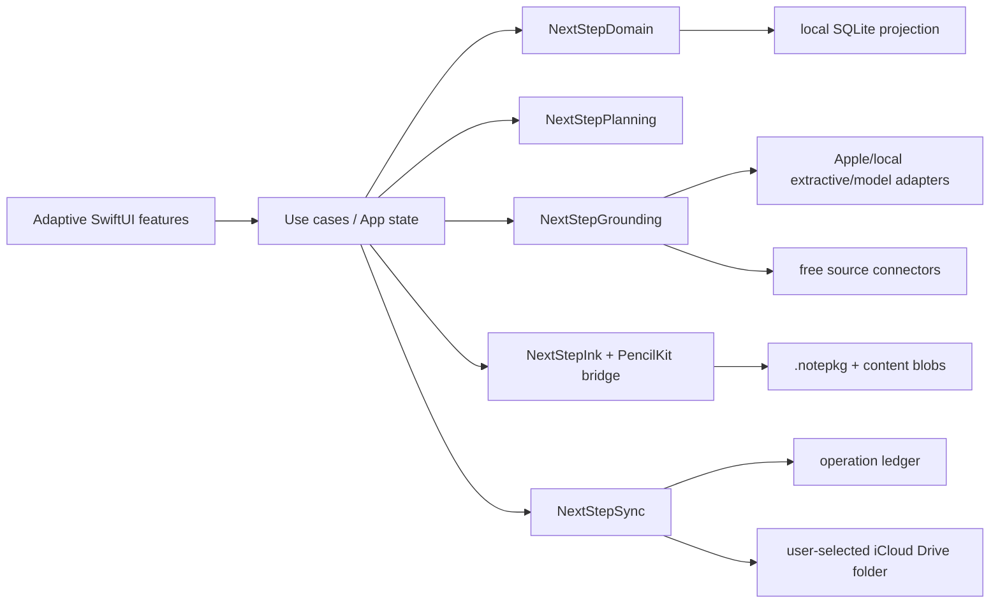

# 10 — Technical Architecture

## Runtime shape



The app has no required backend or NextStep account. iPhone/iPad use the same codebase, domain and contracts; only presentation composition changes.

## Module decisions

- `NotesCore`: retain notebooks, packages, transactions, assets, audio/replay and validation.
- `NotesServices`: retain OCR/search/media/extractive services; adapters implement new protocols.
- `NextStepAcademic`: retain Course/Session/Capture/WrapUp while migrating persistence behind repository interfaces.
- `NextStepDomain`: goals, planning records, learning/source/workspace/ink references and validation.
- `NextStepPersistence`: SQLite3 repositories, migrations, unit-of-work and local blob catalog.
- `NextStepPlanning`: pure deterministic engine and diff.
- `NextStepGrounding`: import jobs, connectors, anchors, evidence, schema/semantic validation and provider abstraction.
- `NextStepSync`: immutable change packs, iCloud Drive transport, merge/conflict and future transport protocol.
- `NextStepInk`: framework-neutral ink envelope/candidates; PencilKit remains the native renderer adapter.
- `NextStepDesignSystem`: tokens and adaptive components shared by features.

Feature code is grouped by user capability (`Today`, `Goals`, `Plan`, `Learning`, `Reader`, `Workspaces`, `Sources`, `Progress`, `Settings`) and calls use cases rather than concrete repositories.

## Persistence

- Use system SQLite3 with WAL for each device's local projection, foreign keys and transactional migrations.
- Do **not** place/open live SQLite WAL files in iCloud Drive.
- Store large/native payloads by SHA-256 in local blobs; keep existing `.notepkg` authoritative for legacy notebooks and lossless PencilKit/audio content.
- FTS5 search and optional embeddings are derived, rebuildable caches.
- Migrate academic JSON once: validated backup → canonical entity import → relation/count/hash check → migration ledger → read-only legacy retention. Never long-term dual write.

## V1 same-Apple-ID sync

On each device the user selects the same iCloud Drive folder once. A security-scoped bookmark is local to that device; it is not assumed to sync.

```text
<chosen folder>/NextStep Sync/<LibraryID>/
  library.json
  devices/<DeviceID>.json
  changes/<yyyy-mm>/<HLC>-<DeviceID>-<OperationID>.json
  blobs/<first-two-sha>/<SHA256>
  acknowledgements/<DeviceID>.json
  snapshots/<SnapshotID>.json
```

- Change packs are immutable, canonical JSON, ≤1 MiB; larger data is a referenced blob.
- File names and payload hashes are validated; symbolic links, traversal and unknown schema are quarantined.
- `NSFileCoordinator`/`NSFilePresenter` guard provider I/O. Downloads are requested explicitly and imports wait for complete, stable files.
- Applying operations is idempotent. Each local transaction commits domain mutation + outbox. Export writes temp, fsyncs, atomically renames; import verifies then applies to SQLite + inbox ledger atomically.
- HLC gives causal ordering without trusting wall clock. Flexible scalars resolve HLC/device-ID; sets and distinct strokes merge by operation ID. Protected facts/same-record concurrent edits become visible conflicts.
- Tombstones persist until every registered non-retired device acknowledges them; manual device retirement is audited.
- Sync is eventual and depends on iCloud Drive availability/capacity. UI never calls it instant or server-authoritative.

Payload compression is deterministic and type-aware: already-compressed PDF/image/audio is not recompressed; large canonical JSON/point payloads may use a versioned lossless codec before hashing the stored bytes. Settings shows local/iCloud quota estimates and pending bytes. Old operation packs/revisions are collected only after a verified snapshot and acknowledgement from every non-retired device; raw source/ink revisions referenced by anchors, audit or exports are retained. Storage pressure may evict rebuildable thumbnails/OCR/model caches first, never canonical user data.

`SyncTransport` has `listChanges`, `read`, `writeImmutable`, `fetchBlob` and `publishAcknowledgement`. A future CloudKit adapter can replace folder transport without changing merge/domain logic. It is not in v1.

## AI/provider interfaces

```swift
protocol DocumentParsing: Sendable
protocol SourceSearching: Sendable
protocol SourceVerifying: Sendable
protocol StructuredGeneration: Sendable
protocol PlanningEngine: Sendable
protocol SyncTransport: Sendable
```

Structured generation accepts a contract ID/version and returns bytes. A central validator performs JSON Schema then domain/evidence validation. `ProviderCapability` reports offline/network, privacy, model availability and supported contracts. Foundation Models adapters compile behind availability checks and are never the only implementation.

## Background work and cache

- BGProcessing/BGAppRefresh are opportunistic only; foreground queues guarantee correctness.
- Import/OCR/index/source lookup/model jobs use persisted job records, state machine, retry-after and cancellation.
- Priority: user ink/save > foreground source page > sync metadata > OCR/index > network enrichment/model.
- Cache keys include input hash, parser/model/contract version and locale. Verification has explicit freshness; original imported sources do not expire.

## Ink persistence and recognition

PencilKit is the V1 low-latency native renderer and lossless compatibility payload; it is not the domain API. `NextStepInk` wraps document/page/layer/stroke identity, style, anchor, revisions and recognized derivatives. New input captures stable stroke metadata when public APIs expose it; legacy/opaque drawings keep their exact `PKDrawing` and may receive derived metadata. A failed derivation never rewrites the native drawing.

Save path: callback stages latest page payload → short debounce/incremental page transaction → content hash + revision → crash-recovery journal → outbox reference. Background/close/page/source/export operations drain or persist a recoverable pending marker. Undo/redo remains command-based and bounded; durable page snapshots checkpoint history. Raw ink, recognition and AI candidates version separately.

Recognition runs after idle/save in a background queue: page/selection raster or stroke metadata → language/formula/layout candidates → bounding boxes/stroke IDs → confidence → user correction → accepted derived text/index. Chinese/English mixed text, digits/symbols, headings/body, lists, tables, diagram regions and basic formulas are explicit test corpora; unsupported confidence stays visible.

Large documents lazy-load visible/adjacent pages, tile PDF/high-resolution images, cache bounded render surfaces and cancel obsolete OCR/model jobs under memory pressure. Sync changes reference page/stroke revisions and content blobs; distinct strokes merge, same-stroke concurrent mutation enters conflict review.

Import accepts existing PDF/image/scan/`.notepkg` and explicitly supported editable formats. Export options are raw NextStep ink/package, editable documented interchange where possible, flattened PDF with/without highlight/AI layers, image, recognized text, Markdown summary and Guided Package. Every export asks whether to include source, ink, highlights, AI annotation, recognition and citations; copyright policy may block embedding a full unlicensed source.

## Error and observability

Typed errors map to user-recoverable states. Logs use `OSLog` with private redaction; operation IDs link local diagnostics without raw content. Local diagnostics include job duration, queue depth, sync lag, schema failures and planner reason codes. Export is explicit and scrubbed; no telemetry is sent.

## Windows and simulation

Apple's Xcode/iOS Simulator is macOS-only. Windows therefore cannot execute the actual SwiftUI/PencilKit binary locally.

- Public macOS CI runs iPhone/iPad simulator tests and exports screenshots/XCResult diagnostics.
- Beta 1 includes a free static browser twin using the same JSON fixtures/tokens, allowing the user to click through Today, Goals, Guided Package, Reader and Replan on Windows.
- The preview must display `Contract preview — not the iOS app` and stub PencilKit, Files/iCloud, Apple Intelligence, notifications, performance and signing.
- Native interactive acceptance requires a physical iPhone/iPad or a Mac-hosted simulator. The project must never claim the web preview is native validation.
